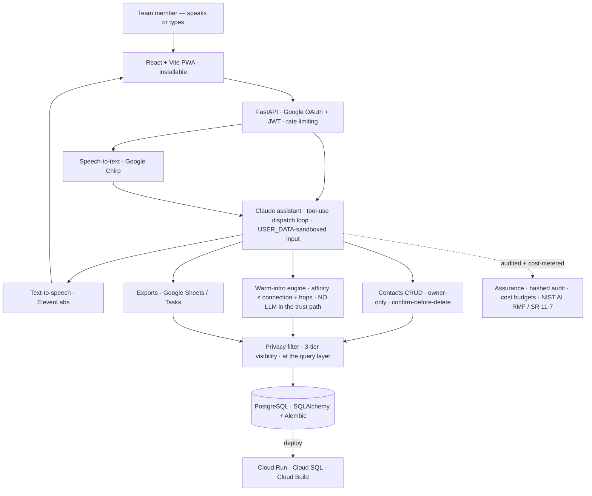

# DESS CRM

[](https://github.com/leighanne77/DESS/actions/workflows/ci.yml)

Voice-first team CRM **+ a deterministic warm-introduction engine** for **DIN — the Dual-Use Investor Network.**

> **About this repository.** This is a **public, scrubbed copy** of a system that runs
> privately in production for a small dual-use investor team. Client specifics, real people,
> and infrastructure identifiers have been removed, and a **fictional demo dataset**
> (`scripts/seed_dummy_data.py`) lets you clone and run the whole thing end-to-end. It's
> here to show the engineering — not to expose a live deployment or any real data.

## 🛠️ Stack

> **No LLM in the trust path.** The model translates the request and narrates the answer; deterministic Python decides who is reachable and how warm a path is — and the privacy filter drops anyone the user is not allowed to see *before* scoring. The assistant can suggest; it cannot decide or leak.

| Layer | Technology |
| --- | --- |
| **Assistant (LLM)** | Anthropic **Claude** via tool-use — natural language → Pydantic-schema-validated tool calls through a bounded dispatch loop (iteration cap, history truncation); untrusted text sandboxed in `<USER_DATA>` delimiters — `app/services/tool_dispatch.py`, `app/routers/chat.py` |
| **Warm-intro engine** | Pure-Python, **deterministic** path-scoring over an in-memory relationship graph — `affinity × connection ÷ hops`, hard safety gates (blocklist + outreach-consent) — `app/services/intro_pathfinder.py`, `intro_paths.py` |
| **Voice** | Vendor-neutral, pluggable **speech-to-text** (Google Cloud Speech / Chirp) + **text-to-speech** (ElevenLabs), voice-activity detection, async UX for high-latency calls — `app/services/voice/` |
| **Data & privacy** | **PostgreSQL** via SQLAlchemy 2.0 + Alembic (psycopg 3); three-tier contact visibility (visible / redacted / hidden) + reveal-fields whitelist, enforced at the **query layer** — `app/services/privacy.py` |
| **Assurance / governance** | Controls mapped to **NIST AI RMF** + **SR 11-7**; Fernet-encrypted OAuth tokens, hashed-payload audit with field-level diffs + CSV export, per-user token/voice cost budgets, structured JSON logs — `app/services/audit.py`, `token_crypto.py`, `admin_cost.py` |
| **Access & identity** | **Google OAuth** (domain allowlist) → short-lived signed **JWT** sessions (HttpOnly / SameSite) — `app/routers/auth.py`, `app/security.py` |
| **API** | **FastAPI** + uvicorn; per-route auth, per-user rate limiting, structured upstream-error mapping (502 / 503) |
| **Frontend** | **React 18 + TypeScript + Vite + Tailwind** SPA; installable **PWA** (vite-plugin-pwa); react-router, react-markdown, lucide icons — `frontend/` |
| **Evals** | **promptfoo** — banned-term avoidance + prompt-injection resistance, deterministic asserts + an LLM rubric — `evals/` |
| **Testing / quality** | **pytest** (+ asyncio), **Playwright** e2e, **mypy --strict**, black · isort · flake8, pre-commit |
| **Deploy (GCP)** | Multi-stage **Docker** (node:20 build → Python runtime) → **Cloud Run** via **Cloud Build** + Artifact Registry; **Cloud SQL** Postgres; migrations run in-container at startup — `Dockerfile`, `cloudbuild.yaml` |

The relationship graph is walked **in memory at team scale** — a graph database is a documented *"adopt-when-it-earns-it"* decision, not a default.

## 🗺️ System at a glance



Everything runs **offline against a fictional demo dataset** — clone, seed, and drive the whole flow yourself (see **[Run it locally](#run-it-locally-clone--run)** below).

## Overview

DESS is a voice-first team CRM for a dual-use investor network — a single-builder system
that ships real assurance, not a demo. It's designed for a small team operating on
sensitive limited-partner (LP) contact data. The interesting part isn't that it's a CRM;
it's that one person carried it from zero to production **with the governance layer that
regulated-industry buyers actually ask for**, and with a warm-introduction engine that
keeps **no LLM in the trust path**.

What's actually in it:

- **A tool-using LLM assistant** — natural-language chat that Claude turns into Pydantic-schema-validated tool calls through a bounded dispatch loop (iteration cap, history truncation), with untrusted text wrapped in `<USER_DATA>` delimiters so notes and messages can never act as instructions.
- **A deterministic warm-introduction engine** — path-scoring over a relationship graph with hard safety gates (blocklist + outreach-consent) and an explainable score (`affinity × connection ÷ hops`). **No LLM in the trust path**: the model translates the request and narrates the answer; code decides who's reachable and how warm a path is.
- **A least-privilege data model** — three-tier contact visibility (visible / redacted / hidden), a reveal-fields whitelist that makes sensitive fields structurally impossible to leak, owner-only edits, soft-delete.
- **An assurance layer mapped to real frameworks** — controls grouped to NIST AI RMF (Govern / Map / Measure / Manage) and SR 11-7 model-risk guidance; Fernet-encrypted OAuth tokens, hashed-payload audit with field-level diffs and CSV export, structured JSON logging with per-request IDs, per-user token/voice cost budgets.
- **A behavioral eval harness** — promptfoo, cases across banned-term avoidance and prompt-injection resistance, graded with deterministic asserts plus an LLM rubric. The "Measure" half of governance: proving the guardrails hold instead of assuming it.
- **A vendor-neutral voice layer** — pluggable speech-to-text and text-to-speech providers, voice-activity detection, async UX patterns for high-latency model calls.
- **A deliberate design discipline** — *"the policy travels, the vendor doesn't"*: every control is built to survive a move to another model host or a multi-agent architecture.

## A day in the life

It's 7:40am. **Alex** opens DESS on her phone — it's installed to the home screen like a
native app — and says: *"Who do I know at the Navy's shipbuilding office?"* DESS reads back
three contacts, warmest first, and offers to remind her to call the top one.

Mid-morning a partner forwards a name. *"Find me a warm intro to Admiral Barrett."* DESS
walks the relationship graph — deterministically — and answers: *"Your warmest path is
through Sam Chen, who's Must-Fly and worked with Barrett at NAVSEA. One hop."* It's not a
black box: the score is `affinity × connection ÷ hops`, and DESS can show its work. A
contact Alex isn't allowed to see never even appears in a path — the privacy filter runs at
the query layer, not as an afterthought, and blocklisted or non-opted-in people are dropped
before scoring.

Over lunch she adds someone by voice: *"New contact, Maria Santos, maritime, must fly."*
DESS creates it, confirms in one sentence, and quietly writes an audit row. When she asks
it to delete a duplicate, DESS **stops and asks her to confirm first** — deletes are never
silent.

By end of day none of it felt like software. She talked; DESS did the legwork; and the
governance — consent gates, redaction, audit, cost budgets — ran underneath without getting
in the way. That's the point: **the assurance is invisible until someone needs to prove it's
there.**

## Guardrails & Governance

DESS is a Claude-powered assistant operating on sensitive LP/contact data, so the assurance
layer is a first-class part of the system. The controls below are grouped to map onto the
frameworks it holds itself to — the **NIST AI Risk Management Framework** (Govern / Map /
Measure / Manage) and **SR 11-7** (model development, validation, ongoing monitoring). Design
intent: **the policy travels, the vendor doesn't.** Every control here is independent of
Claude, FastAPI, ElevenLabs, or Google, and would survive a move to Bedrock, Azure AI
Foundry, or a multi-agent (A2A / MCP) architecture.

**Access & identity**
- Google OAuth restricted to a domain allowlist — `app/routers/auth.py`
- Short-lived signed JWT sessions (HttpOnly, SameSite cookie) — `app/security.py`
- Per-route auth + admin-only gating on sensitive endpoints — `app/dependencies.py`

**Least-privilege on data (PII)**
- Three-tier contact visibility — **visible / redacted / hidden** — `app/services/privacy.py`
- Reveal-fields whitelist makes PII (name, email, phone, notes) structurally impossible to expose — `app/services/tool_dispatch.py`
- Owner-only edits/transfers; soft-delete; PII-safe audit (payload hashed, never stored in plaintext) — `app/services/audit.py`

**LLM / output guardrails**
- System prompt with explicit safety rules (confirm-before-delete, ownership, redaction) — `app/routers/chat.py`
- *Defense-in-depth content policy:* a runtime scrubber enforces the content policy after generation, backing up the prompt instruction — `app/services/voice_rules.py`
- Untrusted input wrapped in `<USER_DATA>` delimiters so notes/messages are never executed as instructions — `app/routers/chat.py`
- Tool calls schema-validated before execution; iteration-cap loop; history truncation — `app/services/tool_dispatch.py`

**Cost & usage governance**
- Per-user daily budgets: input tokens, output tokens, STT minutes, TTS characters — `app/config.py`, `app/models/user.py`
- Daily spend computation + admin alert over threshold — `app/routers/admin_cost.py`

**Auditability & observability**
- Every write audited (user, action, target, hashed payload, field-level diffs) with admin UI + CSV export — `app/services/audit.py`, `app/routers/admin.py`
- Structured JSON logging with per-request IDs — `app/logging_config.py`, `app/config.py`

**Secrets & resilience**
- No secrets in code; Google OAuth tokens encrypted at rest (Fernet); API keys scrubbed from logs — `app/services/token_crypto.py`, `app/services/llm.py`
- Per-user rate limiting; structured upstream-error mapping (502/503); React error boundary on chat — `app/services/rate_limit.py`

### Known gaps / hardening roadmap

The **Measure / ongoing-monitoring** items (the SR 11-7 validation half) not yet in place:
- LLM **output** auditing — today tool calls are logged, not full response text
- Broader **evals** for the scrubber + prompt-injection resistance
- System-prompt **versioning + rollback**
- Server-side **human-in-the-loop** approval for high-risk ops (deletes currently rely on the model asking for confirmation)
- **Data-retention / purge** policy

**Acronyms:** *NIST AI RMF* — the US AI Risk Management Framework. *SR 11-7* — US model-risk
management guidance. *HITL* — human-in-the-loop. *A2A / MCP* — agent-to-agent /
model-context-protocol interop. *Fernet* — symmetric encryption (used for OAuth tokens at rest).

## Run it locally (clone → run)

Everything runs offline with a fictional demo dataset — no real data, no cloud account
needed.

```bash
# 1. Start local Postgres
docker compose up -d

# 2. Backend deps (uses pyproject.toml)
python -m venv .venv && source .venv/bin/activate
pip install -e ".[dev]"

# 3. Copy the env template and fill in values (an Anthropic API key enables chat;
#    the app otherwise runs without it)
cp .env.example .env

# 4. (Optional) pre-commit hooks
pre-commit install

# 5. Apply migrations
alembic upgrade head

# 6. Seed fictional demo contacts (refuses if ENTERPRISE_MODE=true)
python -m scripts.seed_dummy_data

# 7. Run the API
uvicorn app.main:app --reload      # or: make backend

# 8. Frontend (separate terminal)
cd frontend && npm ci && npm run dev   # or, from repo root: make frontend
```

Then open the Vite dev server (`http://localhost:5173`), or hit the API directly:
`curl http://localhost:8000/api/health`.

## Day-to-day commands

`make` targets handle the "did I leave that running?" friction by killing any stale process
before starting a fresh one.

```bash
make backend      # port 8000 — kills stale uvicorn, then `uvicorn --reload`
make frontend     # Vite dev server, port 5173
make test         # backend test suite
make sync-types   # regenerate frontend TS types from the Pydantic models
```

_Full stack + architecture are at the top of this README (**🛠️ Stack** and **🗺️ System at a glance**)._
